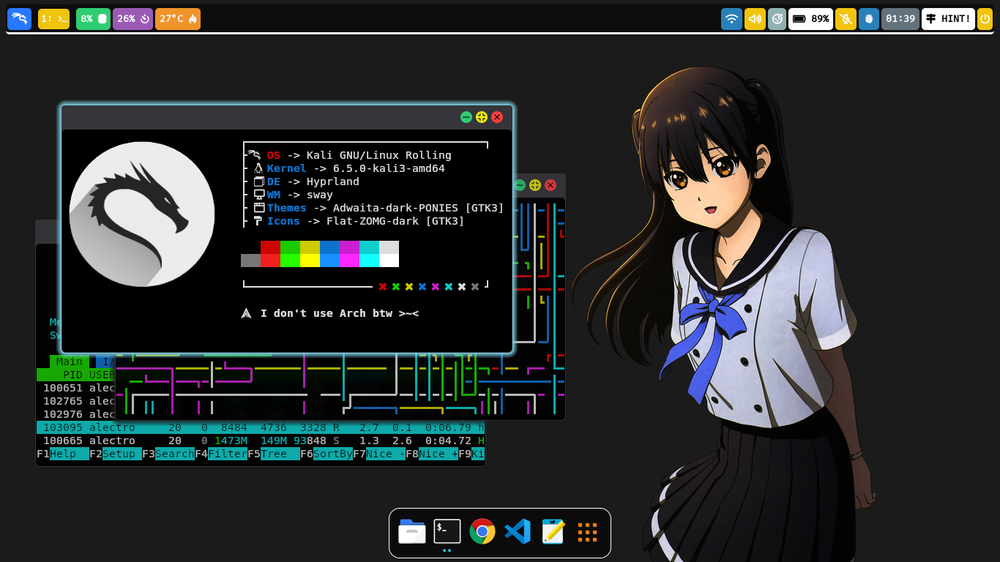
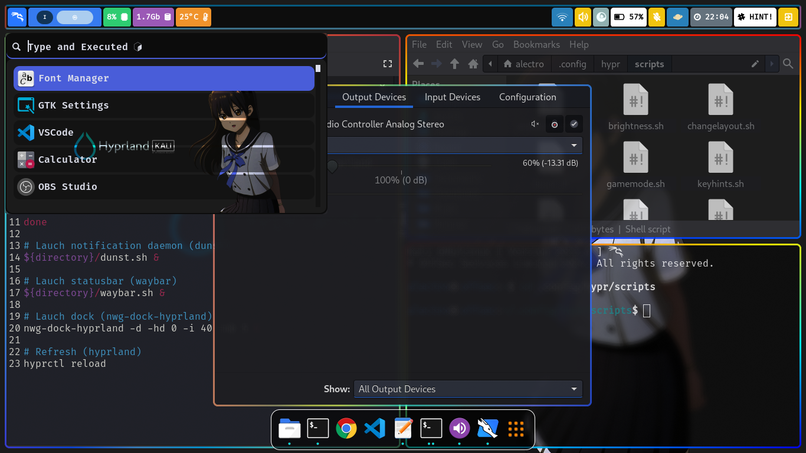

# Dotfiles contents

- **OS** : [Kali-Linux](https://www.kali.org/)
- **DE** : [Hyprland](https://hyprland.org/)
- **WM** : [Sway](https://swaywm.org/)
- **Themes** : [Adwaita-dark-PONIES](https://github.com/cilegordev/Flat-Adwaita)
- **Icons**: [Flat-ZOMG-dark](https://github.com/cilegordev/Flat-Adwaita)
- **Lockscreen**: [Kali-SDDM](https://github.com/cilegordev/kali-sddm)

## Screenshot

|  Simple  |
|  -  |
|    |
| <p align="center"> **Lockscreen** </p> |

|  Classic  |
|  -  |
|    |
| <p align="center"> **Desktop Environment** </p> |

|  Multitasking  |
|  -  |
|    |
| <p align="center"> **Workspace** </p> |

# Dependencies

- **Shell** : zsh
- **Terminal** : xfce4-terminal
- **Text Editor** : code
- **Image Viewer** : ristretto
- **Media Player** : mpv
- **File Manager** : thunar
- **Archive Manager** : file-roller
- **Task Manager** : xfce4-taskmanager
- **Web Browser** : google-chrome

<details>
  <summary>
    <h2>Component</h2>
  </summary>

  - **brightnessctl**
  - btop
  - cava
  - dunst
  - **grim**
  - hypr
  - **hyprland-plugins**
  - **network-manager**
  - nwg-look
  - **polkit-kde-agent-1**
  - **pulseaudio**
  - rofi
  - swappy
  - swaylock
  - swww
  - **udiskie**
  - **upower**
  - waybar
  - **wf-recorder**
  - **wl-clipboard**
  - wlogout
  - **xdg-desktop-portal-hyprland**
  - **yad**

  <h2>Other</h2>

  - font-manager
  - gnome-terminal
  - grub-customizer
  - htop
  - kitty
  - logo-ls
  - microsoft-edge
  - mousepad
  - mugshot
  - neofetch
  - nvtop
  - **nwg-dock-hyprland**
  - **nwg-drawer**
  - pipes.sh
  - qterminal
  - radeontop
  - **wireless-tools**

</details>

# To implement

**Note** : If you need use this dotfiles. recommended use at clean install user or add new user.


Clone this repository.
```zsh
git clone --depth=1 https://github.com/cilegordev/dotfiles ~/dotfiles
```
## Automatic

Run apply.sh
```zsh
~/./dotfiles/apply.sh
```

## Manually

**Optional Y** : If you want xfce you must install additional packages.
```zsh
sudo apt install xfce4* kali-grant-root apt-transport-https psutils -y && pip install psutil
```

**Optional N** : If you don't need xfce you can remove before you copy main command.
```zsh
rm -rf ~/dotfiles/config/autostart ~/dotfiles/config/menus ~/dotfiles/config/xfce4 ~/dotfiles/config/xsettingsd ~/dotfiles/local/share/applications ~/dotfiles/local/share/desktop-directories
```

Copy dotfiles & including things that might be useful.
```zsh
mkdir -p ~/.cache ~/.config ~/.local ~/Pictures/wallpapers && cp -r ~/dotfiles/cache/* ~/.cache/ && cp -r ~/dotfiles/config/* ~/.config/ && cp -r ~/dotfiles/local/* ~/.local/ && cp -r ~/dotfiles/wallpapers ~/Pictures/ && cp -r ~/dotfiles/home/* ~/dotfiles/home/.* ~/ && rm ~/.Hyprland_log*
```

Add symlink. otherwise the dunst, rofi, waybar will be broken.
```zsh
ln -sf ~/.config/dunst/styles/dunstrc-dark ~/.config/dunst/dunstrc && ln -sf ~/.config/waybar/custom_config/config-costume-short ~/.config/waybar/config && ln -sf ~/.config/waybar/style/style-costume-colorful.css ~/.config/waybar/style.css && ln -sf ~/Pictures/wallpapers/exclsv/echo_hello_world.png ~/.config/rofi/.wallpaper && ln -sf ~/.config/dunst/styles/dunstrc-dark ~/.config/dunst/styles/dunstrc && ln -sf ~/.cache/wal/colors-rofi-dark.rasi ~/.config/rofi/pywal-color/pywal-theme.rasi
```

<details>
  <summary>
    <h2>Know Issue</h2>
  </summary>

**Note** : If you use Kali Linux. That means you should know what kind of system you are using. Using Kali Linux means you understand basic knowledge such as using the Package Manager, CLI, etc. This should not be needed. but if it is related to Xfce or Hyprland I think there are several answers. <br>
*~because I really hate so much the question of wifi not working on kali linux.* <br>

<h2> OK NEXT >>> </h2>

I add package for xfce like ``kali-grant-root apt-transport-https psutils`` <br>
use this for configure. <br>
use sudo without asking password. <br>
``sudo dpkg-reconfigure kali-grant-root`` <br>
then ``Enable password-less privilege escalation`` <br>
next ``sudo EDITOR=nano visudo`` <br>
one more step <br>
``root``    ``ALL=(ALL:ALL) ALL`` <br>
``user``    ``ALL=(ALL:ALL) NOPASSWD:ALL`` <br>

Add **https** on your kali repository. <br>
because it was previously installed ``apt-transport-https`` <br>
then ``sudo nano /etc/apt/sources.list`` <br>
``deb https://http.kali.org/kali kali-rolling main contrib non-free non-free-firmware`` <br>
``deb-src https://http.kali.org/kali kali-rolling main contrib non-free non-free-firmware`` <br>

If ``xfce4-panel-profiles`` "Backup and restore" can't open or force close. <br>
just install psutils ``pip install psutil`` <br>

If you need switch bash to zsh. <br>
just run``chsh -s $(which zsh) user`` <br> 

If you need open thunar as root. <br>
``sudo thunar`` and it say <br>
``(thunar:00000): Gtk-WARNING **: 00:00:00.000: cannot open display: :1`` <br>
just run ``sudo -EH thunar`` <br>

If you have trouble **wlan0** can't detect on ``nm-applet`` and it say **"Device Not Ready"** <br>
just remove all **Ethernet** on list. <br>

If you have trouble when doing full screen on the application and it appears like a green splash. <br>
try changing ``vrr = 0`` on ``~/.config/hypr/hyprland.conf`` <br>

The sound will automatically be set at 75% and the mic will be disabled on startup. <br>
because I have made a special script for that ``~/.config/hypr/scripts/privacy.sh`` <br>

Don't try ``systemctl suspend`` use ``hyprctl dispatch dpms off`` if you need configure lockscreen on Hyprland. <br>
because it will make your broken screen. **"50/50"** <br>

If you annoying sound **"beeb" "beeb" "beeb"** when you press Tab on terminal or tty. <br>
just turn off with use the one I have provided in **.zshrc** <br>
``# disable beeb sound effect`` <br>
``#setterm --bfreq=0`` ``#tty`` <br>
``#xset b off`` ``#terminal`` <br>

If you don't want **"core"** in your home directory. <br>
just reconfigure with ``nano /etc/sysctl.conf`` <br>
``# disable core on home directory`` <br>
``fs.suid_dumpable=0`` <br>
``kernel.core_pattern= | /bin/false`` <br>

If keyboard-state not showing on ``waybar`` i think you need ``libinput`` <br>
just install libinput-tools ``sudo apt install libinput-tools`` <br>
then ``sudo usermod -a -G input user`` <br>

<div align="center">
  I hope this it can helps you <a href="https://github.com/cilegordev/dotfiles/?tab=readme-ov-file#know-issue">thanks!</a>
</div>

</details>

# Keybinds

|  Keys  |  Output  |
|  -  |  -  |
| <kbd>Super</kbd> + <kbd>Q</kbd> | Floating
| <kbd>Super</kbd> + <kbd>W</kbd> | Killactive
| <kbd>Super</kbd> + <kbd>E</kbd> | Fullscreen
| <kbd>Super</kbd> + <kbd>R</kbd> | Reload
| <kbd>Super</kbd> + <kbd>T</kbd> | Cava
| <kbd>Super</kbd> + <kbd>Y</kbd> | Pipes
| and use [HINT!](https://github.com/cilegordev/dotfiles/blob/8de73780fdc6317d27c9efe9ba75df7d8dbf51a7/config/hypr/hyprland.conf#L316) | for the rest |

# Credits


- Installed on : Tuesday, 14 November 2023, 03:00
- **Hyprland package currently is not available in any Debian distro repository.**
- Install Hyprland based Debian distro using script by JaKooLit : [Debian-Hyprland](https://github.com/JaKooLit/Debian-Hyprland) include dotfiles.
- Forked from [JaKooLit](https://github.com/JaKooLit/Hyprland-Dots) and i'm remake it almost 90%
- **I can't promise if these dotfiles work on other device. and I configured it for 1366x768 not for below or above it and maybe need a little change in some aspects.**
- And i'll back when a [kali-desktop-hyprland](https://www.kali.org/docs/general-use/metapackages/) [Tracker](https://pkg.kali.org/search?package_name=hyprland) [Index](https://http.kali.org/kali/pool/main/h/hyprland/)
- Hyprland Debian package currently maintenance see it on [GitLab](https://salsa.debian.org/NyxTrail/hyprland)

 <p align="center"> 
   
 </p> 

# License

[GNU General Public License v3.0](LICENSE)
