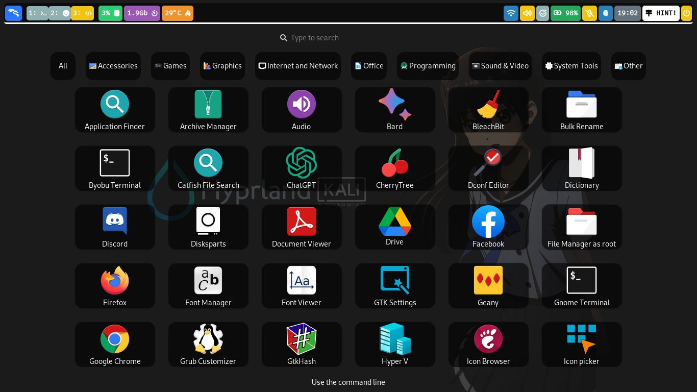

# Hyprland package currently is not available in any Debian distro repository

Install Hyprland based Debian distro using script by JaKooLit : [Debian-Hyprland](https://github.com/JaKooLit/Debian-Hyprland)

# About

- **OS** : [Kali-Linux](https://www.kali.org/)
- **DE** : [Hyprland](https://hyprland.org/)
- **WM** : [Sway](https://swaywm.org/)
- **Themes** : [Adwaita-dark-PONIES](https://github.com/cilegordev/Flat-Adwaita)
- **Icons**: [Flat-ZOMG-dark](https://github.com/cilegordev/Flat-Adwaita)
- **Lockscreen**: [Kali-SDDM](https://github.com/cilegordev/kali-sddm)

## Screenshot

- Lockscreen : simple but cool


- DE : classic but cool


- Menu : using rofi, wofi or nwg-drawer everything is cool



- Installed on : Tuesday, November 14 2023

# Dependencies

- **Shell** : zsh
- **Terminal** : xfce4-terminal
- **Text Editor** : geany
- **Image Viewer** : shotwell
- **Media Player** : vlc
- **File Manager** : thunar
- **Archive Manager** : file-roller
- **Task Manager** : xfce4-taskmanager
- **Web Browser** : waterfox

  ## Component

  - btop
  - cava
  - dunst
  - **grim**
  - hypr
  - **hyprland-plugins**
  - **network-manager**
  - nwg-look
  - **pulseaudio**
  - rofi
  - swappy
  - swaylock-effects
  - swww
  - waybar
  - **wf-recorder**
  - wlogout

  ## Other

  - code
  - font-manager
  - gnome-terminal
  - google-chrome-stable
  - htop
  - logo-ls
  - microsoft-edge-stable
  - neofetch
  - nvtop
  - **nwg-dock-hyprland**
  - **nwg-drawer**
  - pipes.sh
  - qterminal
  - radeontop

# To apply

```zsh
git clone https://github.com/cilegordev/dotfiles ~/dotfiles
cp dotfiles/config/* $Home/.config/
cp dotfiles/local/* $Home/.local/
cp -r dotfiles/wallpapers $Home/Pictures/
sudo -E cp dotfiles/disable-mic /etc/init.d/
chmod +x /etc/init.d/disable-mic
sudo -E update-rc.d disable-mic defaults
```

## If you don't need Xfce you can remove before you cp

```zsh
rm -rf dotfiles/config/autostart
rm -rf dotfiles/config/menus
rm -rf dotfiles/config/neofetch
rm -rf dotfiles/config/xfce4
rm -rf dotfiles/local/share/applications
rm -rf dotfiles/local/share/desktop-directories
```

## If you want Xfce you must install

```zsh
sudo apt install apt-transport-https
sudo apt install kali-grant-root
sudo apt install xfce4*
sudo apt install psutils
# or
pip install psutil
```

# Keybinds

| Keys | Output |
| :--  | :-- |
| <kbd>Super</kbd> + <kbd>Q</kbd> | Hide Waybar
| <kbd>Super</kbd> + <kbd>W</kbd> | Killactive
| <kbd>Super</kbd> + <kbd>E</kbd> | Fullscreen
| <kbd>Super</kbd> + <kbd>R</kbd> | Refresh Waybar
| <kbd>Super</kbd> + <kbd>T</kbd> | Cava
| <kbd>Super</kbd> + <kbd>Y</kbd> | Pipes.sh
| and use [HINT!](https://raw.githubusercontent.com/cilegordev/dotfiles/main/config/hypr/configs/Keybinds.conf) | for the rest |

# Credits

- Forked from [JaKooLit](https://github.com/JaKooLit/Hyprland-Dots)
