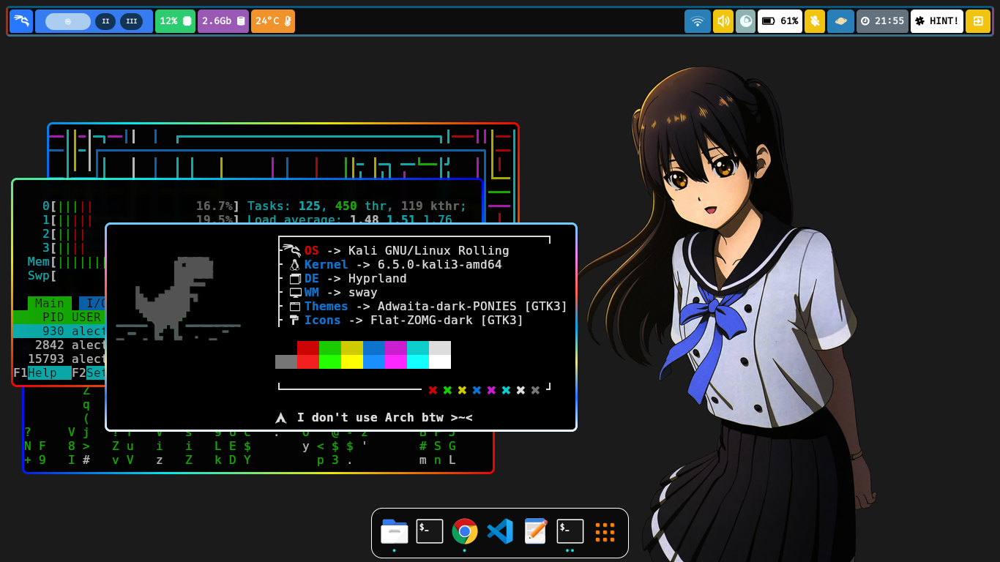

# Dotfiles contents

- **OS** : [Kali-Linux](https://www.kali.org/)
- **DE** : [Hyprland](https://hyprland.org/)
- **WM** : [Sway](https://swaywm.org/)
- **Themes** : [Adwaita-dark-PONIES](https://github.com/cilegordev/Flat-Adwaita)
- **Icons**: [Flat-ZOMG-dark](https://github.com/cilegordev/Flat-Adwaita)
- **Lockscreen**: [Kali-SDDM](https://github.com/cilegordev/kali-sddm)

## Screenshot

|  Simple  |
|  -  |
|    |
| <p align="center"> **Lockscreen** </p> |

|  Classic  |
|  -  |
|    |
| <p align="center"> **Desktop Environment** </p> |

|  Multitasking  |
|  -  |
|    |
| <p align="center"> **Workspace** </p> |

# Dependencies

- **Shell** : zsh
- **Terminal** : xfce4-terminal
- **Text Editor** : code
- **Image Viewer** : ristretto
- **Media Player** : mpv
- **File Manager** : thunar
- **Archive Manager** : file-roller
- **Task Manager** : xfce4-taskmanager
- **Web Browser** : google-chrome-stable

<details>
  <summary>
    <h2>Component</h2>
  </summary>

  - **brightnessctl**
  - btop
  - cava
  - dunst
  - **grim**
  - hypr
  - **hyprland-plugins**
  - **network-manager**
  - nwg-look
  - **polkit-kde-agent-1**
  - **pulseaudio**
  - rofi
  - swappy
  - swaylock
  - swww
  - **udiskie**
  - **upower**
  - waybar
  - **wf-recorder**
  - **wl-clipboard**
  - wlogout
  - **xdg-desktop-portal-hyprland**
  - **yad**

  <h2>Other</h2>

  - font-manager
  - gnome-terminal
  - grub-customizer
  - htop
  - kitty
  - logo-ls
  - microsoft-edge-stable
  - mousepad
  - mugshot
  - neofetch
  - nvtop
  - **nwg-dock-hyprland**
  - **nwg-drawer**
  - pipes.sh
  - qterminal
  - radeontop
  - **wireless-tools**

</details>

# To apply


**Note** : There maybe some differences in symlinks so adjust it to yourself.
```zsh
git clone https://github.com/cilegordev/dotfiles ~/dotfiles
```
## Automatic

Run apply.sh
```zsh
~/./dotfiles/apply.sh
```

## Manually

**Copy dotfiles** & include zsh, twm, eww, neofetch, polybar, nwg-dock-hyprland, weston etc.
```zsh
cp -r ~/dotfiles/cache/* ~/.cache/ && cp -r ~/dotfiles/config/* ~/.config/ && cp -r ~/dotfiles/local/* ~/.local/ && cp -r ~/dotfiles/wallpapers ~/Pictures/
```

If you don't need Xfce you can remove before you copy
```zsh
rm -rf ~/dotfiles/config/autostart ~/dotfiles/config/menus ~/dotfiles/config/xfce4 ~/dotfiles/config/xsettingsd ~/dotfiles/local/share/applications ~/dotfiles/local/share/desktop-directories
```

If you want Xfce you must install.
```zsh
sudo apt install xfce4* kali-grant-root apt-transport-https psutils -y && pip install psutil
```

<details>
  <summary>
    <h2>KNOW ISSUE</h2>
  </summary>
  
I add package for xfce like ``kali-grant-root apt-transport-https psutils`` <br>
use this for configure. <br>
use sodo without asking password. <br>
``sudo dpkg-reconfigure kali-grant-root`` <br>
then <br>
``Enable password-less privilege escalation`` <br>
one more step <br>
``sudo visudo`` <br>
then <br>
``root``    ``ALL=(ALL:ALL) ALL`` <br>
``user``    ``ALL=(ALL:ALL) ALL`` <br>

add **https** on your ``/etc/apt/sources.list`` <br>
``sudo nano /etc/apt/sources.list`` <br>
``deb https://http.kali.org/kali kali-rolling main contrib non-free non-free-firmware`` <br>
``deb-src https://http.kali.org/kali kali-rolling main contrib non-free non-free-firmware`` <br>

if xfce panel backup can't open or force close. <br>
just install psutils ``pip install psutil`` <br>

If you need switch bash to zsh use this <br>
``sudo chsh -s $(which zsh) user`` <br> 

If you have trouble **wlan0** can't detect on **nm-applet** and it say **"Device Not Ready"** <br>
just remove all **Ethernet** on list. <br>

If you have trouble when doing full screen on the application and it appears like a green splash. <br>
try changing it ``vrr = 0`` on ``~/.config/hypr/hyprland.conf`` <br>

The sound will automatically be set at 75% and the mic will be disabled on startup. <br>
Because I have made a special script for that ``~/.config/hypr/scripts/privacy.sh`` <br>

If you need open thunar as root <br>
``sudo thunar`` and it say <br>
``(thunar:00000): Gtk-WARNING **: 00:00:00.000: cannot open display: :1`` <br>
just open ``sudo -EH thunar`` <br>

Don't try ``systemctl suspend`` use ``hyprctl dispatch dpms off`` on Hyprland. <br>
cause it will make your broken screen 50/50 <br>

If you annoying sound **"beeb" "beeb" "beeb"** on terminal or tty. <br>
just turn off with use the one I have provided in .zshrc <br>
``# disable beeb sound effect`` <br>
``#setterm --bfreq=0`` <br>
``#xset b off`` <br>

if you don't want **"core"** in your home directory. <br>
just reconfigure with ``nano /etc/sysctl.conf`` <br>
move <br>
``kern.corefile=/var/log``                   ``#move it to directory`` <br>
or disable it <br>
``kern.coredump=0``                          ``#disable coredump`` <br>
``kern.corefile=/dev/null``                  ``#move it to directory`` <br>

<div align="center">
  I hope this it can helps you <a href="https://github.com/cilegordev/dotfiles/?tab=readme-ov-file#know-issue">thanks!</a>
</div>

</details>

# Keybinds

|  Keys  |  Output  |
|  -  |  -  |
| <kbd>Super</kbd> + <kbd>Q</kbd> | Togglefloating
| <kbd>Super</kbd> + <kbd>W</kbd> | Killactive
| <kbd>Super</kbd> + <kbd>E</kbd> | Fullscreen
| <kbd>Super</kbd> + <kbd>R</kbd> | Reload Waybar
| <kbd>Super</kbd> + <kbd>T</kbd> | Cava
| <kbd>Super</kbd> + <kbd>Y</kbd> | Pipes
| and use [HINT!](https://github.com/cilegordev/dotfiles/blob/8de73780fdc6317d27c9efe9ba75df7d8dbf51a7/config/hypr/hyprland.conf#L316) | for the rest |

# Credits


- Installed on : Tuesday, 14 November 2023, 03:00
- **Hyprland package currently is not available in any Debian distro repository.**
- Install Hyprland based Debian distro using script by JaKooLit : [Debian-Hyprland](https://github.com/JaKooLit/Debian-Hyprland) include dotfiles.
- Forked from [JaKooLit](https://github.com/JaKooLit/Hyprland-Dots) and i'm remake it almost 90%
- **I can't promise if these dotfiles work on other device. and I configured it for 1366x768 not for below or above it and maybe need a little change in some aspects.**
- And i'll back when a [kali-desktop-hyprland](https://www.kali.org/docs/general-use/metapackages/) [Tracker](https://pkg.kali.org/search?package_name=hyprland) [Index](https://http.kali.org/kali/pool/main/h/hyprland/)
- There is news that the Debian [Hyprland](src/hyprland-tracker.jpeg) package is being packaged, hopefully it will be released soon.

 <p align="center"> 
   
 </p> 